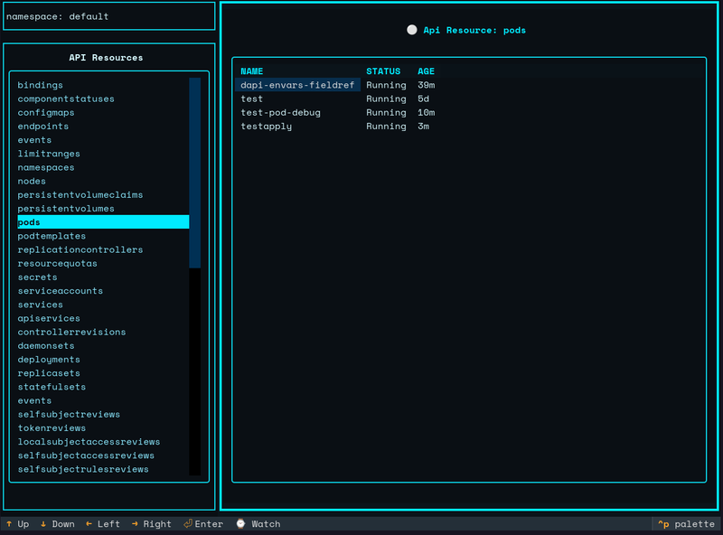

# L8zyKube

L8zy is a Kubernetes Dashboard with a Text User Interface for monitoring resources  




### Installation

Download the latest release:

```bash
wget https://github.com/ITPATJIDR/Kube_TUI/releases/download/v0.0.1/kube-tui
chmod +x kube-tui
```


### TODO

- Enable mouse click support
- Monitor Kubernetes status and disk usage
- Add kubectl exec functionality
- Add kubectl edit functionality
- Error handling optimization
- Switch Kubernetes context


### Features

- Select and filter resources by namespace
- Create new resources
- Watch resource changes in real-time
- View resource logs


# How to Use

First, ensure you have a Kubernetes cluster running (such as minikube or kubeadm). Then execute the following command:

```bash
./kube-tui
```

This will launch the L8zyKube dashboard interface.


# Navigation

Use the **Arrow keys** to navigate through the interface. Press **Enter** to focus on content and **ESC** to unfocus.


<br/>

# Watch Mode

Press **CTRL + W** to start watching resources in real-time. Press **CTRL + W** again to stop watching.


<br/>

# Logs

Press **CTRL + L** to view resource logs. Press **ESC** to return to the main interface.

